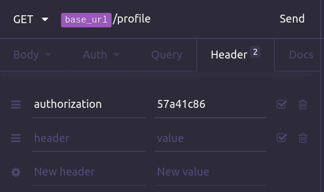
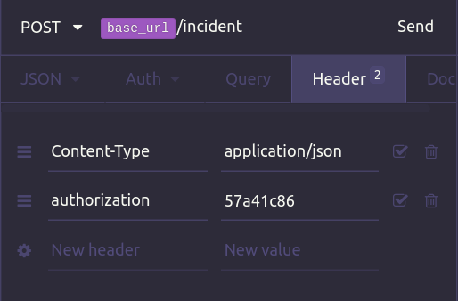
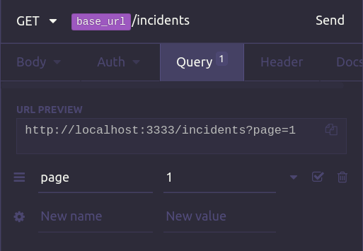
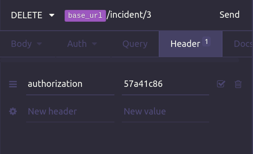

#### `npm install` para instalar as dependencias da api

```
  Help com os comandos disponiveis knex
   npx knex

  Criar migration
   npx knex migrate:make < name migration >

  Subir migations knex sqlite
   npx knex migrate:latest
```
___

### Routes
  - #### Ongs
  > POST Create
  > http://localhost:3333/ongs
  >
  > recebe os seguintes parametros todos __String__
  >
  > "name": "TEST",
	> "email": "test@api.com",
	> "whatsapp": "123456789",
	> "city": "Teresina",
	> "uf": "pi"

___

  > GET List
  > http://localhost:3333/ongs
  >
  > retornar todas as ongs cadastradas

___

  - ### Login
  > POST Create
  > http://localhost:3333/session
  >
  > recebe como parametro o id da ONG previamente cadastrada
  >
  > "id": "57a41c86"
___

  - ### Profile
  > GET List
  > http://localhost:3333/session
  >
  > lista os casos especificos de cada ONG
  > recebe no **HEADER** da requisição um parametro
  > **authorization** = ID da ONG
  >
  > 

___

  - ### Incident
  > POST Create
  > http://localhost:3333/incident
  >
  > rota responsavel por registrar novos incidents
  > recebe no **HEADER** da requisição um parametro
  > **authorization** = ID da ONG
  >
  > no body recebe os seguintes parametros todos __String__ exceto value que e um tipo numerico
  >
  > "title": "donate",
  > "description": "donate money",
  > "value": 115.8,
  >
  > 

  > GET List
  > http://localhost:3333/incidents
  >
  > na rota de listagem de incidents so e preciso receber o parametro **page**
  > sevira para fazer a paginação
  > nos Query params sera enviado o numero da pagina
  >
  > 


  > DELETE Delete
  > http://localhost:3333/incident/:id
  >
  > recebe o ID do incidet a ser deletado no req.params
  > recebe no **HEADER** da requisição o authorization
  > **authorization** = ID da ONG
  > assim só e possivel deletar os incidents de quem esta logado
  >
  > 

___

### Button to export routes to insomnia
[](https://insomnia.rest/run/?label=Be%20the%20hero&uri=https%3A%2F%2Fgithub.com%2Fmaycon8609%2FBe-the-hero%2Fblob%2Fmaster%2Fbackend%2Fdata-insomnia%2FInsomnia-All_2020-04-18.json)

